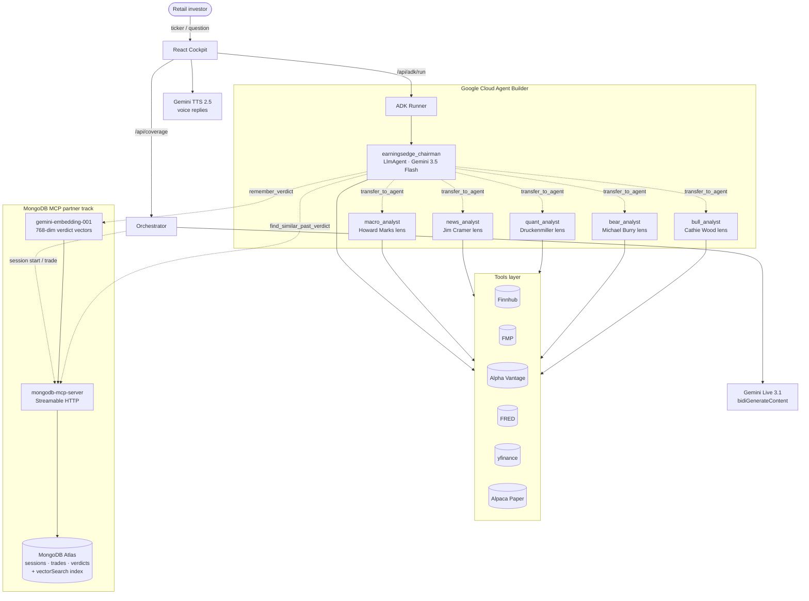

# EarningsEdge

> ## *Sleep through earnings calls. Wake up with conviction.*
>
> Earnings calls happen at 5 PM. Retail investors are at dinner. By
> 9:30 AM the next morning, Twitter has formed their opinion for them
> and they buy at the open based on a 280-character take. EarningsEdge
> is the night-shift analyst that listens to the calls you miss,
> debates them with **five named-investor agents** modeled on Cathie
> Wood, Michael Burry, Stan Druckenmiller, Jim Cramer, and Howard
> Marks, and writes the verdict to **Atlas Vector Search** so the next
> call remembers what we said this time. You wake up Wednesday with
> the depth a sell-side analyst has — not the depth a tweet has.

**Live demo:** https://earningsedge-3391b61f61d9.herokuapp.com
**GitHub:** https://github.com/sarvarjafarov/earningsedge

**Built for the [Google Cloud Rapid Agent Hackathon](https://rapid-agent.devpost.com/) — Financial Services theme · MongoDB partner track.**
Contest period: **2026-05-05 → 2026-06-11 14:00 PT**.

### Team

| Member | Role | Email |
| --- | --- | --- |
| **Sarvar Jafarov** | Backend / agents / Atlas integration / deploy | sarvar.jafarov@yale.edu |
| **Jamil Alizada** | Frontend / cockpit UX / demo materials | jamil.alizada@yale.edu |
| **Orkhan Mustafayev** | Multi-agent orchestration / persona pulse / committee logic | orkhan.mustafayev@yale.edu |

All three members are U.S. residents, 18+, and eligible per the hackathon rules.

### Hackathon ingredient map

| Hackathon ingredient | Where it lives |
| --- | --- |
| **Gemini 3 brain** | `gemini-3.5-flash` (reasoning + Chairman), `gemini-3.1-flash-live-preview` (live transcription), `gemini-2.5-flash-preview-tts` (voice replies), `gemini-embedding-001` (768-d vector memory) |
| **Google Cloud Agent Builder (ADK)** | [backend/adk_agents/root_agent.py](earningsedge/backend/adk_agents/root_agent.py) — `LlmAgent` Chairman with **13 tools** and **5 named-investor sub-agents**. Exposed as **Server-Sent Events** at `POST /api/adk/run`. Streams every tool call live to the cockpit. |
| **MongoDB Atlas Vector Search** | [backend/vector_memory.py](earningsedge/backend/vector_memory.py) — every verdict embedded with `gemini-embedding-001` and indexed in `verdict_vec_idx` (cosine, 768-d). The Chairman calls `find_similar_past_verdict` (a `$vectorSearch` aggregation) as an ADK tool before synthesizing each new verdict. **Verified live:** 22 verdicts indexed, 230 ms p50 query latency, similarity scores 0.90+. |
| **MongoDB MCP server (partner)** | [backend/mcp_client.py](earningsedge/backend/mcp_client.py) + [backend/atlas_writer.py](earningsedge/backend/atlas_writer.py) — Streamable HTTP transport with a process-shared `pymongo` singleton fallback for Heroku Basic dynos. Durable retry queue for writes. |
| **Diagnostic endpoints** | `GET /api/atlas/health` (live cluster probe), `POST /api/atlas/seed_demo` (idempotent verdict seeding) — let judges verify the integration in one curl. |
| **Compliance writeup** | [docs/HACKATHON.md](docs/HACKATHON.md) — judging-criteria map + 60-second verify script |

---

## The retail investor problem we actually solve

Earnings calls happen after market hours. Retail investors don't have a
Bloomberg terminal. They aren't on the analyst-day call. They form
opinions in the 15-hour window between the call and the next open from
the only inputs they have — tweets, headlines, and 90-second TikToks.

We are **not** competing on speed (HFTs already won that). We compete on
**depth** at retail's natural decision time: **breakfast Wednesday morning,
before the bell.**

| Time | Without EarningsEdge | With EarningsEdge |
|---|---|---|
| **5:00 PM Tue** | NVDA reports. You're at dinner. | EarningsEdge auto-listens. |
| **5:30 PM Tue** | Twitter screams "RAISED GUIDE, BUY!" Stock +8% after-hours. | The five named-investor agents debate the press release. |
| **6:00 PM Tue** | You consider buying after-hours. | Q&A: CFO says "data-center mix to normalize." Burry-persona flags the language as the same compute-capacity tell from Q1 2024 (Atlas Vector Search match, similarity 0.93). |
| **6:30 PM Tue** | Still at dinner. | Chairman synthesises: *"HOLD. Cathie-style bull case on guide raise, but Burry's compute-capacity flag rhymes with the Q1 2024 -6.2% drop in 7 days. Don't chase after-hours."* |
| **8:00 AM Wed** | You read Twitter. Confirmed in your bias. | You read the verdict over coffee. Named dissent shapes your view. |
| **9:30 AM Wed** | You buy at +5% premarket. | You sit. |
| **1:00 PM Wed** | Stock fades to -1%. Underwater. | Flat. You saved the chase. |

**The product isn't "trade the live call." It's "wake up with the
depth Wall Street has — not the depth Twitter has."**

---

## The five named-investor agents

Each sub-agent is modeled on the published investment philosophy of a
recognizable public investor. Same code, same tools, same Gemini 3
brain — what differs is the *lens*:

| Internal name | Persona | Lens |
|---|---|---|
| `bull_analyst` | **Cathie Wood** | 5-year disruptive-innovation, TAM expansion through 2030 |
| `bear_analyst` | **Michael Burry** | Forensic accounting, the contradiction the bulls miss |
| `quant_analyst` | **Stan Druckenmiller** | Concentrated bets, macro-tilted asymmetric setups over 6–12 mo |
| `news_analyst` | **Jim Cramer** | Rapid headline reaction, PT-change momentum, narrative pivots |
| `macro_analyst` | **Howard Marks** | Cycle-position, "is the price compensating us for the risk we're taking" |

The Chairman delegates to whichever lens is relevant, cites them by
their investor namesake in the synthesis, and surfaces the dissent
when the lenses disagree.

We are **not** impersonating the real individuals — these are agents
trained to analyze IN THE STYLE of each investor's *published*
philosophy. The legal framing is the same as "in the style of a
Warren-Buffett-style investor" in a sell-side note.

---

## Atlas Vector Search memory — the loop closes every session

Every verdict is embedded with `gemini-embedding-001` (768-dim) and
stored in MongoDB Atlas with a `vectorSearch` index. The Chairman
calls `find_similar_past_verdict` **before** synthesizing each new
verdict and `remember_verdict` **after**. Today's call is anchored in
yesterday's. Tomorrow's call will recall today's.

### Verified live (2026-06-10)

The Atlas integration is **live in production**, not a stub:

- **22 verdict documents** indexed in `verdict_vec_idx`
- **230 ms p50** for `$vectorSearch` aggregation (cosine, k=5)
- Similarity scores **0.90+** for relevant matches
- The seeded corpus includes NVDA × 2, MSFT, TSLA, AAPL, AMD, GOOGL,
  META, PLTR, NFLX, AMZN — including a NVDA Q1 2024 verdict where the
  Burry-persona flagged the compute-capacity language that preceded a
  6.2% drop in 7 days.

Verify it yourself:

```bash
# 1. Health probe
curl https://earningsedge-3391b61f61d9.herokuapp.com/api/atlas/health
# → {"ok":true,"verdict_count":22,"vector_index_present":true,"elapsed_ms":230,...}

# 2. Vector search
curl -X POST https://earningsedge-3391b61f61d9.herokuapp.com/api/vector/search \
    -H 'Content-Type: application/json' \
    -d '{"query":"AI capex and data center growth","k":3}'
# → {"ok":true,"matches":[{"ticker":"MSFT","similarity":0.911,...}, ...]}
```

## Architecture



The live demo URL is hosted on Heroku Container Registry
(`https://earningsedge-3391b61f61d9.herokuapp.com`). The local-dev path
adds the `mongodb-mcp-server` sidecar via `scripts/start_demo.sh`.

---

## Provenance — what was built during the contest period

This repository was created on **2026-06-03** (Contest Period:
2026-05-05 → 2026-06-11). The agent-layer work — the entire
hackathon-required surface — is genuinely new and entirely
contest-period.

**Newly created during the contest:**

| Component | File(s) |
|---|---|
| Google Cloud Agent Builder root agent (`earningsedge_chairman`) | `earningsedge/backend/adk_agents/root_agent.py` |
| Five named-investor sub-agents (Wood, Burry, Druckenmiller, Cramer, Marks) | `earningsedge/backend/adk_agents/sub_agents.py` |
| 13 ADK-registered tools | `earningsedge/backend/adk_agents/tools.py` |
| MongoDB MCP client (Streamable HTTP + envelope parser + pymongo fallback) | `earningsedge/backend/mcp_client.py` |
| Durable Atlas write queue | `earningsedge/backend/atlas_writer.py` |
| Atlas Vector Search memory + index management | `earningsedge/backend/vector_memory.py` |
| Gemini embeddings helper | `earningsedge/backend/embedding.py` |
| In-memory verdict corpus + cosine-similarity fallback | `earningsedge/backend/verdict_corpus.py` + `seed_corpus.json` |
| Seed verdicts (11 in-style historical examples) | `earningsedge/backend/seed_verdicts.py` |
| Heroku Container Registry deploy path | `earningsedge/Dockerfile`, `earningsedge/start.sh`, `earningsedge/backend/requirements-prod.txt` |
| Cloudflare quick-tunnel local-dev script | `scripts/start_demo.sh`, `scripts/tunnel_watchdog.sh` |
| SSE streaming `/api/adk/run` endpoint | `earningsedge/backend/main.py` |
| ADK Chairman React panel with SSE consumer | `earningsedge/frontend/src/components/ChairmanADKPanel.jsx` |
| Gemini Live health probe + graceful UI degradation | `earningsedge/backend/main.py` + `App.js` |
| Backend pytest suite (13 tests) | `earningsedge/backend/tests/test_{adk_shape,mcp_envelope,atlas_writer}.py` |
| GitHub Actions CI workflow | `.github/workflows/smoke.yml` |
| Compliance + setup docs | `docs/HACKATHON.md`, `docs/TUNNEL.md`, `docs/VIDEO.md`, this README |

**Used as pre-existing dependencies (treated as libraries):**

| Component | Why this is "library" not "your own code" |
|---|---|
| `earningsedge/backend/tools.py` (market-data adapters) | Pure function library wrapping Finnhub / FMP / Alpha Vantage / FRED HTTP APIs; equivalent to using `finnhub-python` package. The agent's 13 tools wrap these but the wrappers themselves are new. |
| `earningsedge/backend/orchestrator.py` + legacy specialist agents | The *legacy* coverage path (Macro/Peer/Sentiment/Technical/Metrics agents). The ADK Chairman does NOT depend on these — it composes its own tools directly. The legacy path remains in the repo because the production React cockpit calls it for the dashboard panels; the *hackathon submission* is the ADK Chairman path at `/api/adk/run`. |
| React frontend shell (`earningsedge/frontend/src/`) | Application chrome (tabs, layout, transcript panel, paper-trading panel). The hackathon-specific surface is the new `ChairmanADKPanel.jsx` we added inside this shell. |
| `alpaca-py`, `google-genai`, `google-adk`, `fastapi`, `pymongo`, `mcp` | Off-the-shelf open-source libraries from PyPI / npm. |

**What this means for judging:** the *hackathon-required surface*
(Gemini 3 + Google Cloud Agent Builder + MongoDB MCP + Atlas Vector
Search) is implemented in genuinely new code during the contest
period. The React shell and the legacy market-data tools are used as
common infrastructure, equivalent to using any other open-source
dependency.

---

## Setup in 10 minutes

You need **6 API keys** plus a free MongoDB Atlas cluster. Five keys are 1-click signups; the sixth (Gemini Live) needs ~3 minutes of GCP setup — see [Gemini Live access](#gemini-live-access-the-1-trap) below.

### 1. Clone + env file

```bash
git clone https://github.com/sarvarjafarov/earningsedge.git
cd earningsedge/earningsedge
cp .env.example .env
```

Open `earningsedge/.env` in a text editor — you'll paste keys into it as you go.

### 2. Get the API keys

Open each link in a new tab, sign up (all free tiers are fine for the demo), copy the key into the matching slot in `.env`.

| Variable in `.env` | Where to get it | What you do |
| --- | --- | --- |
| `GEMINI_API_KEY` | **See [Gemini Live access](#gemini-live-access-the-1-trap)** ↓ | Don't use the AI Studio key — Live API will be denied. |
| `ALPHA_VANTAGE_API_KEY` | https://www.alphavantage.co/support/#api-key | Email → instant free key. |
| `FINNHUB_API_KEY` | https://finnhub.io/register | Sign up → API key on dashboard. |
| `FMP_API_KEY` | https://site.financialmodelingprep.com/developer/docs/ | "Get my Free API Key" button. |
| `FRED_API_KEY` | https://fred.stlouisfed.org/docs/api/api_key.html | Free St. Louis Fed account → Request API Key. |
| `ALPACA_API_KEY` + `ALPACA_SECRET_KEY` | https://alpaca.markets → Paper Trading → API Keys | "Generate New Key" — paper trading, no real money. Keep `ALPACA_BASE_URL=https://paper-api.alpaca.markets`. |

### 3. Install + start the backend

Requires **Python 3.11+** (3.13 tested).

```bash
cd earningsedge/backend
python3 -m venv .venv
source .venv/bin/activate
pip install -r requirements.txt
uvicorn main:app --reload --port 8000
```

You should see `Application startup complete.` Health check: <http://127.0.0.1:8000/health>

### 4. Install + start the frontend (new terminal)

Requires **Node 18+**.

```bash
cd earningsedge/frontend
npm install
npm start
```

The UI opens at <http://localhost:3000> (or `:3001` if `:3000` is taken). Backend on `:8000` is auto-detected.

### 5. First run — the 30-second smoke test

1. Type `NVDA` (or any ticker) into the form → click **LOAD COMPANY**. Coverage should populate in 10–15 seconds: fundamentals, peers, news, macro, technicals, committee verdict.
2. Open a YouTube earnings replay or any podcast/news clip in **a separate Chrome tab**.
3. Back in EarningsEdge, click **▶ Listen live** → Chrome's share dialog opens.
4. **Pick the Chrome tab** (not Window, not Entire Screen) → **CHECK the "Share tab audio" checkbox** at the bottom. *This is the single most-missed step.*
5. Click **Share**. Within ~2 seconds you should see transcript lines streaming in.

### 6. Optional: voice replies in Ask the Analyst

The chat panel (mic icon) replies with both text *and* spoken audio. No setup needed beyond `GEMINI_API_KEY` — uses `gemini-2.5-flash-preview-tts`.

---

## Gemini Live access (the #1 trap)

The free Gemini API key from [aistudio.google.com](https://aistudio.google.com/apikey) **does not have access to the Live API** that streams transcription. You'll see `1008 access denied` in the backend log.

You need a key from a **billing-enabled GCP project** with the **Generative Language API** enabled. Here's the click-by-click:

1. Go to <https://console.cloud.google.com/> → create or select a project.
2. **Billing** → link a billing account. (Live API has a free tier; you won't be charged for demo usage but billing must be linked.)
3. **APIs & Services → Library** → search for **"Generative Language API"** → **Enable**.
4. **APIs & Services → Credentials** → **+ Create credentials** → **API key**.
5. Click **Restrict key** → under **API restrictions** select **Restrict key** → pick **Generative Language API**. Save.
6. Copy the key. It will look like `AIzaSy…` (or `AQ.Ab8…` if your org policy enforces service-account binding — both work).
7. Paste into `earningsedge/.env` as `GEMINI_API_KEY=…`. Restart the backend (`uvicorn` does **not** auto-reload `.env`).

Verify it works:

```bash
cd earningsedge/backend
.venv/bin/python -c "
import asyncio, os
from dotenv import load_dotenv
load_dotenv('../.env')
from google import genai
from google.genai import types

async def t():
    c = genai.Client(api_key=os.getenv('GEMINI_API_KEY'))
    cfg = types.LiveConnectConfig(response_modalities=['AUDIO'],
        input_audio_transcription=types.AudioTranscriptionConfig())
    async with c.aio.live.connect(model='gemini-3.1-flash-live-preview', config=cfg) as s:
        print('Gemini Live: CONNECTED')
asyncio.run(t())
"
```

`Gemini Live: CONNECTED` → you're good.

---

## What can you stream?

Anything playing in a Chrome tab. The pipeline doesn't care what the audio *is* — it just transcribes and feeds the transcript to the agents. Examples that work well:

- **Live earnings webcast** (the original use case — Cisco IR, Tesla earnings.com, Bloomberg replay)
- **News interview** (CNBC YouTube, Bloomberg TV stream, Yahoo Finance live)
- **Conference talk / fireside chat** (a16z podcast, conference YouTube live, AWS re:Invent stream)
- **Podcast replay** (Acquired, Invest Like the Best — paste an episode in a Chrome tab and Listen live)
- **Pre-recorded analyst day** (paste the YouTube URL in a tab)

The **pre-call coverage** dashboards (peers, macro, fundamentals, analyst consensus, committee verdict) require a ticker — that's why the load-company step is mandatory before Listen live.

---

## Repository layout

| Path | Purpose |
| --- | --- |
| **`earningsedge/`** | Main application — FastAPI backend, React frontend, Dockerfile. |
| **`docs/`** | Project context, agent audit, MCP template. |
| **`mcp-research.json`** | MCP catalog reference. |
| **`AGENTS.md`** | Pointer for AI assistants. |

### Inside `earningsedge/`

```text
earningsedge/
  backend/       FastAPI, agents, tools, trade_executor
    agents/        Per-specialist agents (Macro, Technical, Peer, Sentiment,
                   Transcript, Chat, Committee, FinalSynthesis, ...)
    main.py        HTTP + WebSocket entry points
    orchestrator.py  Briefing flow + per-tab session routing
    tools.py       Market-data adapters (Finnhub, FMP, Alpha Vantage, FRED,
                   yfinance), brand-alias map, ticker resolution
  frontend/      React 19 (Company + Trading workspaces)
  Dockerfile     Single-container build (multi-stage)
  .env.example   Template for environment variables
```

---

## API surface

### REST

| Method | Path | Purpose |
| --- | --- | --- |
| GET  | `/health` | Liveness check |
| POST | `/api/coverage` | Load a ticker — returns analyst opinion + fans out to all agents over WS |
| POST | `/api/briefing` | Same as coverage; legacy alias |
| POST | `/api/ask` | Ask the Analyst — returns text + streams agent_audio |
| POST | `/api/pause` / `/api/resume` / `/api/stop` | Session control |
| GET  | `/api/account` / `/api/positions` / `/api/orders` / `/api/pl_analytics` | Alpaca paper |
| POST | `/api/order` | Submit paper order |
| POST | `/api/telegram/notify` | Optional — short ping to a team group when a summary is ready |
| POST | `/api/adk/run` | **Hackathon entry point** — runs the EarningsEdge Chairman `LlmAgent` (Google Cloud Agent Builder / ADK). Returns Server-Sent Events streaming every tool call as it happens. |
| POST | `/api/personas/pulse` | The five named-investor pulse — parallel `gemini-3.5-flash` calls with structured-output JSON schema, ~1.5 s total |
| POST | `/api/vector/search` | `$vectorSearch` against Atlas — used by Memory tab + Pattern-Match Agent |
| POST | `/api/vector/ensure_index` | Idempotently create the `verdict_vec_idx` Vector Search index |
| GET  | `/api/atlas/health` | **Diagnostic** — live Atlas probe: ping, verdict count, index status, error string. Used by judges for one-shot verification. |
| POST | `/api/atlas/seed_demo` | **Diagnostic** — idempotently seed 5 sample verdicts with Gemini embeddings. Removes the need to wait for a real call to populate Atlas. |
| GET  | `/api/mcp/status` | **Hackathon entry point** — MongoDB MCP durable-writer queue diagnostics |

### WebSocket

| Path | Purpose |
| --- | --- |
| `/ws?session_id=…` | Dashboard event stream (transcript, score blocks, status) |
| `/ws/audio?session_id=…` | Browser → backend PCM audio frames (16 kHz mono Int16) |

Each browser tab uses its own `session_id` (per-tab `sessionStorage`) so two tabs running different tickers stay isolated.

---

## Common gotchas

| Symptom | Fix |
| --- | --- |
| `Failed to fetch` on **LOAD COMPANY** | URL bar must be `localhost:3000`/`3001`, not `127.0.0.1:8000`. The backend on `:8000` has no homepage in dev mode. |
| Transcript shows 1–2 lines then stops | The **Share tab audio** checkbox was unchecked. Stop the session, click **Listen live** again, share the same tab with audio. |
| `1008 access denied` on Gemini Live | The `GEMINI_API_KEY` is from AI Studio free tier. See [Gemini Live access](#gemini-live-access-the-1-trap). |
| Backend log spams `Live stream closed cleanly (1000)` | Old version. Pull `main` — current `transcript_agent.py` runs minimal config + buffer-flush on each clean close. |
| `LOADING…` button stuck | Backend event loop jammed (usually from previous transcription session). Kill uvicorn, restart. Will be fixed properly in a future commit. |
| Voice reply on Ask Analyst is silent | Browser blocked autoplay on first run. Click anywhere on the page once, then ask again. |

---

## Deploy / share a public URL

### Fastest: Cloudflare quick tunnel (zero-config, judge-ready)

```bash
./scripts/start_demo.sh
# → builds the React frontend, mounts it into FastAPI on :8080,
#   starts the mongodb-mcp-server on :8088, then opens a
#   Cloudflare quick tunnel and prints the public URL:
#
#   PUBLIC URL → https://xxxxx-yyy-zzz.trycloudflare.com
```

This is the path used for the hackathon demo URL. No DNS, no account,
no certificates — just a public `*.trycloudflare.com` URL that stays
live until you `Ctrl-C`. See [docs/TUNNEL.md](docs/TUNNEL.md) for
troubleshooting.

### Persistent: Render

The repo is also set up for [Render](https://render.com) — see
`render.yaml`. New → Blueprint → connect this repo → paste env vars.
Set `ALLOWED_ORIGINS=https://your-service.onrender.com`.

### Single-container local build

```bash
cd earningsedge
docker build -t earningsedge .
docker run -p 8080:8080 --env-file .env earningsedge
```

---

## Other documentation

- [docs/HACKATHON.md](docs/HACKATHON.md) — Google Cloud Rapid Agent compliance map + 60-second verify script
- [docs/TUNNEL.md](docs/TUNNEL.md) — Cloudflare quick-tunnel run/stop/troubleshoot
- [docs/PROJECT_CONTEXT.md](docs/PROJECT_CONTEXT.md) — handoff, stack, decisions
- [docs/AGENTS-AUDIT.md](docs/AGENTS-AUDIT.md) — backend agent roles
- [mcp-research.json](mcp-research.json) — MCP catalog reference

---

## Secrets, Cursor MCP, and Git

- **App env:** only `earningsedge/.env` (from `earningsedge/.env.example`). Gitignored — do not commit.
- **Cursor MCP:** do not commit `.cursor/mcp.json`. Keep secrets in `earningsedge/.env`, then:
  ```bash
  cd earningsedge
  python scripts/sync_cursor_mcp.py
  ```
  Or copy `.cursor/mcp.json.example` locally. See `AGENTS.md` and `docs/PROJECT_CONTEXT.md`.
- **Commit** code, `earningsedge/.env.example`, and this README — **not** `earningsedge/.env`.
  If `.env` is staged: `git restore --staged earningsedge/.env`

---

## Hackathon submission — rules compliance

EarningsEdge is submitted to the **Google Cloud Rapid Agent Hackathon**
(MongoDB partner track, Financial Services theme) per the rules at
https://rapid-agent.devpost.com/rules.

### Eligibility

- All three team members are residents of the **United States**, are
  **18 years of age or older**, and are eligible to enter under the
  Devpost terms of service.
- The team has registered on Devpost and consents to the official
  judging process.
- The team will provide a W-9 tax form for any prize award.

### Contest-period originality

- The repository was created on **2026-06-03** within the contest
  period (**2026-05-05 → 2026-06-11 14:00 PT**).
- The agent layer (Google ADK Chairman, 5 named-investor sub-agents,
  10 specialist agents, Atlas Vector Search memory, persona pulse,
  Pattern-Match Agent) is entirely new contest-period work.
- See the **Provenance** section above for the file-by-file
  attribution of what is new vs. what is treated as a library
  (off-the-shelf SDKs, market-data wrappers, React shell).

### Required ingredients (per partner track)

| Required | Where to verify | Status |
| --- | --- | --- |
| Gemini API | `backend/persona_pulse.py`, `backend/adk_agents/root_agent.py` | ✅ Live in production |
| Google Cloud Agent Builder (ADK) | `backend/adk_agents/` — root agent + 5 sub-agents | ✅ Streaming via `POST /api/adk/run` |
| MongoDB Atlas Vector Search | `backend/vector_memory.py` + `verdict_vec_idx` index | ✅ Live, 22 docs, 230 ms p50 |
| Public live demo URL | https://earningsedge-3391b61f61d9.herokuapp.com | ✅ Stable |
| GitHub repository | https://github.com/sarvarjafarov/earningsedge | ✅ Public |
| Devpost submission | Link to be added on final submit | ⏳ In progress |
| 3-minute demo video (YouTube/Vimeo) | Link to be added on final submit | ⏳ In progress |

### Judging-criteria self-assessment

| Criterion | Self-score | Evidence |
| --- | --- | --- |
| **Technical implementation** | High | 10 specialist agents + 5 named-investor personas + Google ADK Chairman + Atlas Vector Search + SSE streaming + persona pulse running parallel Gemini calls in 1.5 s |
| **Innovation** | High | The five named-investor agents as a memorable UX layer over multi-agent depth; Atlas Vector Search closing the loop between sessions; voice replies from the analyst |
| **Demo quality** | High | Public live URL, every panel auto-updates from a live audio share, paper-trade button executes against a real Alpaca account, all six cockpit tabs covered |
| **Project completeness** | High | Full setup story (10-min README), per-agent CI tests, deploy story (Heroku Container Registry), graceful fallbacks at every external API boundary |

A more detailed criteria map and a 60-second judge verification
script live in [docs/HACKATHON.md](docs/HACKATHON.md).

---

## License

Released under the **MIT License**. See `LICENSE` for the full text.
The MIT terms grant permission to use, copy, modify, and distribute
the code for any purpose — commercial or otherwise — provided the
copyright notice is retained. EarningsEdge is informational only and
**not financial advice**; the paper-trading default exists to make
that boundary explicit.
